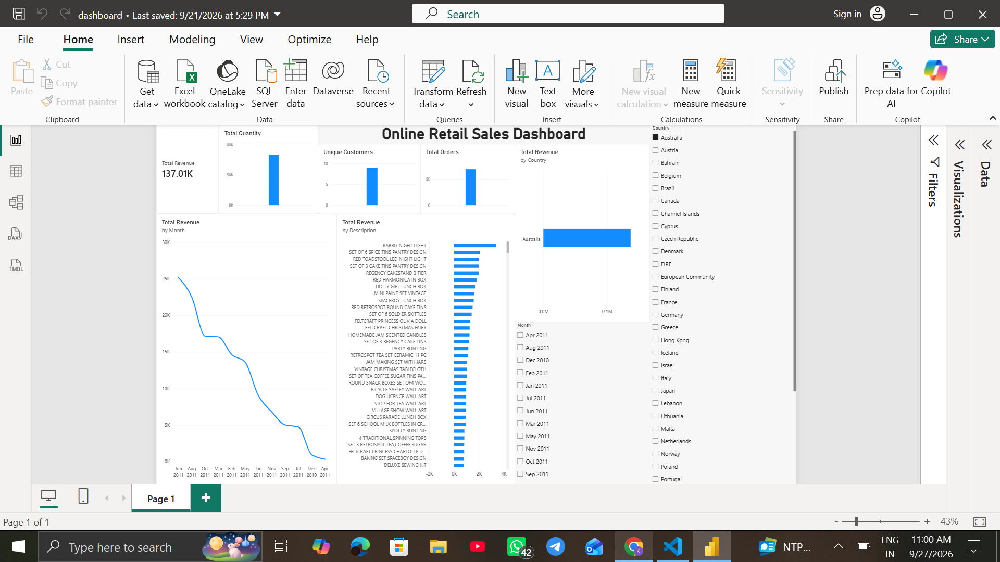

# SWYNEX Final Data Analytics Project

## Online Retail Sales Analysis

This project is a complete data analytics case study developed as part of my Data Analytics Internship with SWYNEX Technologies.

The project uses an Online Retail dataset to clean transaction data, analyze sales and customer patterns, identify key business insights, and present the findings through an interactive Power BI dashboard.

---

## 1. Problem Statement

Retail businesses generate large amounts of transaction data, but raw transaction records can contain duplicates, missing values, returns, cancellations, and other data-quality issues.

The objective of this project is to analyze the Online Retail dataset and answer important business questions such as:

- How much revenue was generated?
- Which months had the highest sales?
- Which countries generated the most revenue?
- Which customers contributed the most revenue?
- What patterns can be identified from the transaction data?
- How can the results be presented through an interactive dashboard?

---

## 2. Project Objectives

- Clean and prepare the retail transaction dataset
- Perform exploratory data analysis
- Analyze revenue and sales trends
- Analyze country-wise performance
- Identify high-value customers
- Create visualizations to communicate findings
- Develop an interactive Power BI dashboard
- Generate meaningful business insights

---

## 3. Dataset Information

The dataset contains online retail transaction records.

### Main Columns

| Column | Description |
|---|---|
| InvoiceNo | Unique invoice number |
| StockCode | Product/item code |
| Description | Product description |
| Quantity | Number of items purchased |
| InvoiceDate | Date and time of transaction |
| UnitPrice | Price per item |
| CustomerID | Unique customer identifier |
| Country | Customer's country |

### Dataset Size

- Original dataset: **541,909 rows**
- Final cleaned dataset: **536,529 rows**
- Number of columns: **8**

---

## 4. Tools & Technologies

- Python
- Pandas
- NumPy
- Matplotlib
- Jupyter Notebook
- Power BI
- GitHub

---

## 5. Data Cleaning & Preparation

The raw dataset was prepared before performing the analysis.

The main cleaning and preparation steps included:

- Removing duplicate transaction records
- Cleaning unnecessary spaces from text fields
- Handling missing values in the `Description` column
- Reviewing missing `CustomerID` values
- Checking negative and zero quantities
- Checking negative and zero unit prices
- Reviewing cancelled transactions
- Verifying the final dataset structure and data types

After cleaning, the dataset contained **536,529 rows and 8 columns**.

The `CustomerID` column still contains missing values because customer information was not available for every transaction.

---

## 6. Exploratory Data Analysis

The analysis focused on several important areas:

### Revenue Analysis

Revenue was calculated using:

`Revenue = Quantity × UnitPrice`

The total transaction revenue, including returns and negative transactions, was approximately **9.73 million**.

### Monthly Sales Analysis

Monthly revenue was analyzed to identify sales trends over time.

**November 2011** recorded the highest monthly revenue in the analysis.

### Country-wise Analysis

Revenue was grouped by country to understand geographical sales performance.

The **United Kingdom** generated the highest revenue in the dataset.

### Customer Analysis

Customer-level revenue was analyzed to identify high-value customers.

Customer **14646** generated the highest customer-level revenue, with approximately **280,206** in revenue.

---

## 7. Key Business Insights

The analysis produced the following key insights:

1. The final cleaned dataset contained **536,529 transaction records**.
2. The total transaction revenue including returns was approximately **9.73 million**.
3. **November 2011** was the highest-revenue month.
4. The **United Kingdom** was the highest-revenue country.
5. Customer **14646** was the highest-revenue customer.
6. The dataset contained negative quantities and cancelled transactions, which are important when interpreting revenue.
7. Data cleaning was essential for producing reliable analysis and visualizations.

---

## 8. Power BI Dashboard

An interactive Power BI dashboard was developed to visually present the major findings.

The dashboard includes:

- Revenue KPIs
- Sales trends
- Country-wise analysis
- Customer analysis
- Interactive filters
- Visual summaries of important business metrics

### Dashboard Preview



The complete dashboard PDF is available in the `dashboard` folder.

---

## 9. Project Structure

```text
SWYNEX-Final-Data-Analytics-Project
│
├── data/
│   └── cleaned_online_retail.csv
│
├── notebook/
│   └── final_data_analysis.ipynb
│
├── dashboard/
│   └── dashboard.pdf
│
├── images/
│   └── dashboard.png
│
└── README.md
```

---

## 10. Skills & Learning Outcomes

Through this project, I gained practical experience in:

- Data cleaning and preprocessing
- Exploratory Data Analysis
- Pandas and NumPy
- Data visualization with Matplotlib
- Revenue analysis
- Customer analysis
- Country-wise sales analysis
- Working with real-world transaction data
- Power BI dashboard development
- Extracting business insights
- GitHub project documentation

---

## 11. Conclusion

This project demonstrates an end-to-end data analytics workflow, starting from data cleaning and preparation and progressing through exploratory analysis, visualization, dashboard development, and business insights.

Python was used for data preparation and analysis, while Power BI was used to create an interactive dashboard.

The project provided practical experience in transforming raw transaction data into meaningful information that can support business analysis and decision-making.

---

## Internship

Completed as part of my Data Analytics Internship with **SWYNEX Technologies**.

#SWYNEX #DataAnalytics #Python #Pandas #PowerBI #DataAnalysis #Internship